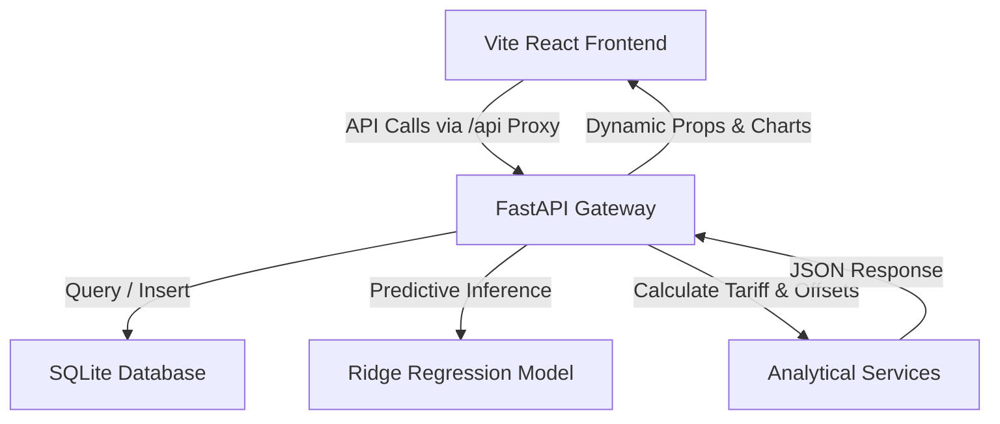

# ⚡ Smart Electricity Intelligence Platform

An AI-powered SaaS analytics dashboard designed to help household electricity consumers monitor consumption, forecast next month's usage, estimate monthly utility bills, compute ecological carbon impacts, and view actionable energy-saving insights.

---

## 📌 Table of Contents
- [Problem Statement](#-problem-statement)
- [The Solution](#-the-solution)
- [System Architecture](#-system-architecture)
- [Tech Stack](#-tech-stack)
- [Project Directory Structure](#-project-directory-structure)
- [Quick Start Guide](#-quick-start-guide)
  - [Prerequisites](#prerequisites)
  - [1. Backend Setup](#1-backend-setup)
  - [2. Frontend Setup](#2-frontend-setup)
- [Key Features](#-key-features)

---

## 🔍 Problem Statement

Modern energy grids and residential consumers face several critical challenges:
1. **Lack of Predictive Visibility**: Consumers only find out about their electricity expenses at the end of the billing cycle when the utility bill arrives.
2. **Complex Progressive Tariffs**: Billing structures (such as the Maharashtra State Electricity Distribution tariff) utilize progressive tiers or "slabs" where unit rates jump significantly at specific thresholds (e.g. ₹3.50/unit to ₹11.00/unit). Crossing these thresholds without warning leads to unexpected bill spikes.
3. **Hidden Ecological Impact**: There is a significant disconnect between consuming electricity (kWh) and understanding its actual carbon footprint (kg CO₂) and environmental consequences.

---

## 💡 The Solution

The **Smart Electricity Intelligence Platform** bridges this information gap by:
- **AI Forecasting**: Utilizing a Scikit-Learn Ridge Regression model trained on historical inputs (lag features) to predict next month's consumption (kWh) with high reliability.
- **Dynamic Slab Tracking**: Running an estimator matching progressive tariff boundaries to compute upcoming bills and warning users when they approach higher rate brackets.
- **Carbon Indexing**: Converting energy usage to carbon equivalents (kg CO₂), illustrating ecological footprint via visual metrics such as the equivalent number of mature trees required to offset emissions and equivalent vehicle travel distance.
- **Actionable AI Insights**: Generating personalized recommendations to guide users to lower their peak loads and avoid billing slab escalations.

---

## 🌐 System Architecture



---

## 🛠️ Tech Stack

### Frontend
- **Core**: React 19, TypeScript
- **Build Tool**: Vite 8
- **Styling**: Tailwind CSS v4
- **Charts**: ChartJS & `react-chartjs-2`
- **Routing**: React Router 7
- **Icons**: Lucide React

### Backend
- **Core**: Python 3.13, FastAPI
- **Database / ORM**: SQLite, SQLAlchemy
- **Machine Learning**: NumPy, Scikit-learn (Ridge Regression)
- **Server**: Uvicorn

---

## 📁 Project Directory Structure

```text
Smart-Electricity-Intelligence-Platform/
│
├── backend/                  # FastAPI Application
│   ├── app/
│   │   ├── config/           # DB & Env Configurations
│   │   ├── models/           # SQLAlchemy DB Models & Model Loader
│   │   ├── routes/           # FastAPI router endpoints (Users, Consumption, Forecast)
│   │   ├── schema/           # Pydantic validation schemas
│   │   └── services/         # Calculation Services (Tariff, Carbon, Forecasting)
│   ├── model_artifacts/      # Serialized Ridge Regression model
│   └── requirements.txt      # Backend Python dependencies
│
└── frontend/                 # React SPA Application
    ├── src/
    │   ├── api/              # Unified API client using Fetch
    │   ├── components/       # Common UI elements (Card, Button, Navbar)
    │   ├── constants/        # Route mappings and options
    │   ├── sections/         # Screen Views (Landing, Create User, History Form, Dashboard)
    │   ├── App.tsx           # Page Router and Application Root
    │   └── main.tsx          # Application Entry
    ├── vite.config.ts        # Vite build & development proxy setup
    ├── tsconfig.json         # TypeScript compiler configurations
    └── package.json          # Frontend JavaScript dependencies
```

---

## 🚀 Quick Start Guide

### Prerequisites
- Python 3.10+ installed
- Node.js 18+ installed

### 1. Backend Setup
1. Open a terminal and navigate to the backend directory:
   ```bash
   cd backend
   ```
2. Create and activate a Python virtual environment:
   ```bash
   python -m venv backend-env
   # On Windows (PowerShell):
   .\backend-env\Scripts\Activate.ps1
   # On macOS/Linux:
   source backend-env/bin/activate
   ```
3. Install dependencies:
   ```bash
   pip install -r requirements.txt
   ```
4. Start the FastAPI server:
   ```bash
   uvicorn app.main:app --reload --host 127.0.0.1 --port 8000
   ```
   The backend documentation will be accessible at `http://127.0.0.1:8000/docs`.

### 2. Frontend Setup
1. Open a new terminal and navigate to the frontend directory:
   ```bash
   cd frontend
   ```
2. Install Node modules:
   ```bash
   npm install
   ```
3. Configure your local environment in `.env.local`:
   ```env
   VITE_API_URL=/api
   ```
4. Start the Vite dev server:
   ```bash
   npm run dev
   ```
   Open `http://localhost:8443` in your browser.

---

## ✨ Key Features

- **Profile Manager**: Create a new energy profile or search for an existing profile by Name and Email.
- **Consumption History Entry Form**: Input exactly 12 months of historical usage records with real-time completion tracking.
- **Predictive Consumption Trends**: Interactive dual-dataset line graph showing historical figures alongside a dotted forecast point.
- **Intelligent Billing Estimates**: Automatically projects the next bill based on Maharashtra electricity slab pricing rules.
- **Ecological Impact Indicators**: Visual equivalency metrics illustrating carbon footprint equivalent trees and car driving mileage.
- **Dynamic AI Insights**: Generates notifications alerting consumers of spikes, slab warning thresholds, and energy-saving recommendations.
