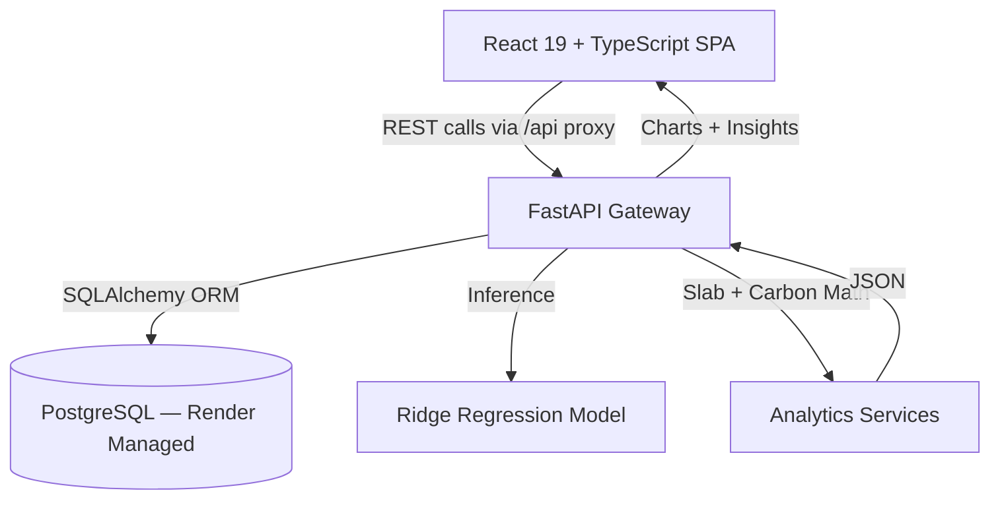

<div align="center">

# ⚡ Electricity Intelligence Platform

**AI-powered consumption forecasting, tariff-slab billing estimation, and carbon-impact analytics for residential electricity consumers.**

[](https://www.python.org/)
[](https://fastapi.tiangolo.com/)
[](https://react.dev/)
[](https://www.typescriptlang.org/)
[](https://www.postgresql.org/)
[](./LICENSE)
[](#-live-demo)

[Live Demo](#-live-demo) · [Documentation](#-api-reference) · [Report Bug](../../issues) · [Request Feature](../../issues)

</div>

---

## 📖 Overview

Electricity bills in India — and particularly under **MSEDCL/MERC telescopic tariff structures** — are notoriously opaque. A household has no way of knowing it just crossed from a ₹3.50/unit slab into an ₹11.00/unit slab until the bill lands, sometimes weeks after the damage is done.

**Electricity Intelligence Platform** closes that loop. It ingests 12 months of historical consumption, forecasts next month's usage with a trained regression model, projects the resulting bill against real slab boundaries, and translates the number into something a non-technical user actually understands — carbon output, equivalent trees, equivalent kilometers driven.

> Built as a full-stack, production-deployed application — not a notebook demo. Backend is live on Render with a managed PostgreSQL instance.

---

## 🎯 Live Demo

| Environment | Link | Status |
|---|---|---|
| Frontend | `<ADD_YOUR_DEPLOYED_FRONTEND_URL>` | 🟢 |
| Backend API | `<ADD_YOUR_RENDER_BACKEND_URL>/docs` | 🟢 |

> **Note:** Free-tier Render backends spin down after inactivity — first request may take 30–50s to cold-start.

---

## 🧩 Problem → Solution

| Problem | This platform's answer |
|---|---|
| Bills are only known *after* the billing cycle ends | Ridge Regression forecast of next month's kWh, generated from 12 months of lag features |
| Progressive tariff slabs cause silent bill spikes | A slab-matching engine that flags proximity to the next rate breakpoint *before* it's crossed |
| kWh numbers mean nothing to most users | Conversion to kg CO₂, equivalent mature trees required for offset, and equivalent km driven |
| No proactive guidance | Rule-based insight engine surfacing spikes, slab warnings, and reduction recommendations |

---

## 🏗️ System Architecture



**Request flow:** Frontend → `/api` proxy → FastAPI routes → service layer (forecasting / tariff / carbon) → PostgreSQL → JSON response → React charts & insight cards.

---

## 🛠️ Tech Stack

<table>
<tr>
<td valign="top" width="50%">

**Frontend**
- React 19 + TypeScript
- Vite 8
- Tailwind CSS v4
- Chart.js (`react-chartjs-2`)
- React Router 7
- Lucide React icons

</td>
<td valign="top" width="50%">

**Backend**
- Python 3.13 + FastAPI
- PostgreSQL + SQLAlchemy ORM
- Scikit-learn (Ridge Regression)
- Pydantic schema validation
- Uvicorn ASGI server
- Deployed on Render (managed Postgres + env-based config)

</td>
</tr>
</table>

---

## 📁 Project Structure

```text
electricity-intelligence-platform/
│
├── backend/
│   ├── app/
│   │   ├── config/          # DB connection + environment config (Render-safe, no hardcoded URLs)
│   │   ├── models/          # SQLAlchemy models + serialized model loader
│   │   ├── routes/          # /users, /consumption, /forecast endpoints
│   │   ├── schema/          # Pydantic request/response schemas
│   │   └── services/        # Tariff, carbon, and forecasting business logic
│   ├── model_artifacts/     # Trained Ridge Regression model (pickled)
│   └── requirements.txt
│
└── frontend/
    ├── src/
    │   ├── api/              # Centralized fetch client
    │   ├── components/       # Card, Button, Navbar, shared primitives
    │   ├── constants/        # Route + option maps
    │   ├── sections/         # Landing, Create User, History Form, Dashboard
    │   ├── App.tsx
    │   └── main.tsx
    ├── vite.config.ts
    ├── tsconfig.json
    └── package.json
```

---

## 🚀 Quick Start

### Prerequisites
- Python 3.10+
- Node.js 18+
- A PostgreSQL instance (local or managed — e.g. Render, Supabase, Neon)

### Backend

```bash
cd backend
python -m venv backend-env
source backend-env/bin/activate      # Windows: .\backend-env\Scripts\Activate.ps1
pip install -r requirements.txt
```

Create `backend/.env`:
```env
DATABASE_URL=postgresql://<user>:<password>@<host>:<port>/<database>
```

```bash
uvicorn app.main:app --reload --host 127.0.0.1 --port 8000
```

Interactive API docs → `http://127.0.0.1:8000/docs`

### Frontend

```bash
cd frontend
npm install
```

Create `frontend/.env.local`:
```env
VITE_API_URL=/api
```

```bash
npm run dev
```

App runs at `http://localhost:8443`

---

## 📡 API Reference

| Method | Endpoint | Description |
|---|---|---|
| `POST` | `/api/users` | Create a new consumer profile |
| `GET` | `/api/users/{id}` | Fetch profile by ID |
| `POST` | `/api/consumption` | Submit 12-month historical usage record |
| `GET` | `/api/consumption/{user_id}` | Retrieve stored consumption history |
| `GET` | `/api/forecast/{user_id}` | Get next-month kWh forecast + bill estimate + carbon metrics |

> Full request/response schemas available at `/docs` (Swagger UI) when the backend is running.

---

## ✨ Key Features

- **Profile management** — create or retrieve a consumer profile by name/email
- **Guided history intake** — 12-month usage entry with real-time completion tracking
- **Forecast visualization** — historical + forecasted consumption on a single interactive chart
- **Slab-aware billing** — bill projection computed against actual MSEDCL telescopic tariff breakpoints
- **Carbon translation** — kWh converted to kg CO₂, equivalent trees, and equivalent km driven
- **Proactive insights** — automated flags for spikes and upcoming slab-threshold breaches

---

## 🗺️ Roadmap

- [ ] Add authentication (JWT-based user sessions)
- [ ] Multi-state tariff support beyond Maharashtra
- [ ] Automated test suite (pytest + Vitest)
- [ ] CI/CD pipeline (GitHub Actions)
- [ ] Historical bill upload via OCR

---

## 🤝 Contributing

Issues and PRs are welcome. For major changes, open an issue first to discuss scope.

```bash
git checkout -b feature/your-feature
git commit -m "feat: description"
git push origin feature/your-feature
```

---

## 📄 License

Distributed under the MIT License. See [`LICENSE`](./LICENSE) for details.

---

<div align="center">

Built by **Rohan Acharya** ([@R0han2906](https://github.com/R0han2906))

</div>
